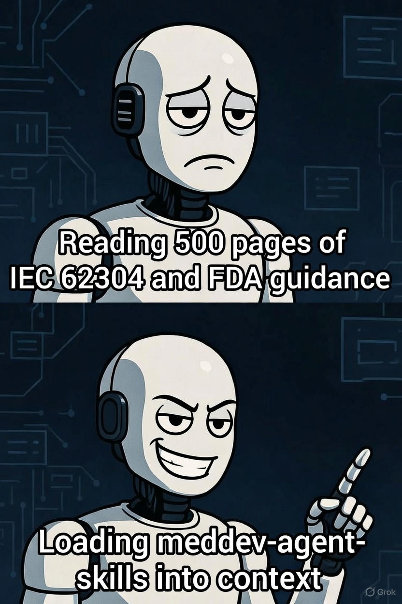

# Habilidades del Agente para Dispositivos Médicos

  

Archivos de "habilidad" modulares para agentes de código IA que trabajan en software de dispositivos médicos. Cada habilidad captura orientación acotada y accionable (requisitos, patrones, antipatrones, verificación) para ayudar a los agentes a generar código más seguro y conforme, sin reemplazar la revisión regulatoria humana.

---

## Qué es este repositorio

- **Orientación curada** alineada con estándares de dispositivos médicos (IEC 62304, ISO 14971, FDA, MDR UE)
- **Lecturable por máquina** y amigable para agentes (esquema consistente, metadatos, prerrequisitos)
- **Enfocado en código** con patrones, antipatrones y listas de verificación

## Público Objetivo

- **Ingenieros de Dispositivos** — Desarrolladores embebidos, de conectividad y en la nube que crean software médico
- **Ingenieros de CA/RA** — Profesionales de calidad y asuntos regulatorios que colaboran con desarrollo asistido por IA  
- **Creadores de Herramientas** — Integración de habilidades del dominio en Copilot, Claude, Cursor o agentes personalizados

---

## Inicio Rápido

1. Seleccione las habilidades relevantes por dominio y jurisdicción (por ejemplo, `regulatory/iec-62304`, `security/secure-boot`)
2. Cargue las habilidades en el contexto de su agente: comience con `SKILL_SCHEMA.md` y luego agregue habilidades específicas
3. Siga la lista de verificación al escribir/revisar código
4. Mantenga la trazabilidad: Requisitos -> Diseño -> Código -> Pruebas
5. Consulte `examples/` para patrones reales con anotaciones

## Uso con Asistentes de IA

**Claude / Cursor / Copilot**: Cargue los archivos `SKILL.md` relevantes en el contexto; incluya primero el esquema.

**Recuperación (RAG)**: Indexe por metadatos (`skill_id`, `jurisdiction`, `applies_to`) para búsqueda por similitud.

**Agentes Personalizados**: Implemente encadenamiento de prerrequisitos desde el frontmatter YAML; filtre por clase/jurisdicción.

---

## Índice de Habilidades

### Regulación
| Habilidad | Descripción |
|-------|-------------|
| [IEC 62304](regulatory/iec-62304/) | Referencia central de ciclo de vida de software por clase (A/B/C); Cláusulas 4–9 |
| [IEC 62304 Software Risk](regulatory/iec-62304-software-risk/) | Proceso de gestión de riesgos de software de la Cláusula 7 |
| [IEC 62304 Legacy Software](regulatory/iec-62304-legacy-software/) | Vía de software heredado de la Enmienda A1 (4.4) |
| [ISO 14971](regulatory/iso-14971/) | Integración de gestión de riesgos, controles de peligros, trazabilidad |
| [FDA Premarket](regulatory/fda-premarket/) | Documentación de software para presentación, SBOM, ciberseguridad |
| [FDA 820 Design Controls](regulatory/fda-820-design-controls/) | 21 CFR 820.30, DHF, verificación frente a validación, alcance de ISO 13485 |
| [EU MDR](regulatory/eu-mdr/) | Expectativas de software específicas del MDR y Regla 11 |
| [IEC 62366 Usability](regulatory/iec-62366-usability/) | Evaluación formativa/sumativa, riesgo relacionado con el uso, verificación de IU |
| [SaMD Clinical Evaluation](regulatory/samd-clinical-evaluation/) | Uso previsto, categoría IMDRF, evidencia clínica, vinculación con CER |
| [AI/ML Device Software](regulatory/ai-ml-medical-device-software/) | GMLP, gobernanza de datos, PCCP, monitoreo de deriva, SOUP del modelo |
| [Postmarket & Labeling](regulatory/postmarket-labeling-ifu/) | Reclamaciones, vigilancia, retiros/ACSF, IFU y etiquetado en dispositivo |
| [IEC 62443](regulatory/iec-62443/) | Ciberseguridad industrial para dispositivos conectados |
| [21 CFR Part 11](regulatory/21-cfr-part-11/) | Registros/firmas electrónicas, rastros de auditoría |

### Arquitectura
| Habilidad | Descripción |
|-------|-------------|
| [Safety Classification](architecture/safety-classification/) | Aplicación de clase a la arquitectura, segregación, pruebas |
| [Separation of Concerns](architecture/separation-of-concerns/) | Segmentación de límites críticos de seguridad |
| [State Machines](architecture/state-machines/) | Estados seguros, transiciones, patrones de prueba |
| [Fault Tolerance](architecture/fault-tolerance/) | Detección, degradación, watchdog, recuperación |
| [Defensive Design](architecture/defensive-design/) | Validación de entrada/salida, aserciones, manejo de errores |

### Firmware
| Habilidad | Descripción |
|-------|-------------|
| [Embedded C](firmware/embedded-c/) | Orientación y ejemplos embebidos alineados con MISRA-C |
| [Embedded C++](firmware/embedded-cpp/) | Conjunto de características C++ controlado para dispositivos |
| [RTOS Patterns](firmware/rtos-patterns/) | Tareas, prioridades, IPC, temporización, evitar inversión de prioridad |
| [Memory Management](firmware/memory-management/) | Asignación estática, pools, uso de MPU |
| [Power Management](firmware/power-management/) | Suspendencia/activación, monitoreo de batería, apagado ordenado |
| [Interrupt Handling](firmware/interrupt-handling/) | Estructura de ISR, secciones críticas, pruebas |
| [Hardware Abstraction](firmware/hardware-abstraction/) | Capas HAL y probabilidad |

### Conectividad
| Habilidad | Descripción |
|-------|-------------|
| [BLE Medical](connectivity/ble-medical/) | Servicios BLE seguros para dispositivos que contienen PHI |
| [WiFi Medical](connectivity/wifi-medical/) | WPA3/empresa, gestión de certificados, coexistencia |
| [USB Medical](connectivity/usb-medical/) | Selección de clase, enumeración, seguridad |
| [Interoperability](connectivity/interoperability/) | HL7 FHIR/IHE, terminología, diseño de API |

### Seguridad
| Habilidad | Descripción |
|-------|-------------|
| [Authentication](security/authentication/) | Autenticación de usuario/dispositivo, sesiones, RBAC |
| [Encryption](security/encryption/) | Algoritmos, KDFs, datos en reposo/en tránsito |
| [Secure Boot](security/secure-boot/) | Cadena de arranque, firmas, protección contra retroceso |
| [Secure OTA](security/secure-ota/) | Actualizaciones firmadas, atomicidad, retroceso, endurecimiento de servidor |
| [Key Management](security/key-management/) | Generación, almacenamiento, rotación, revocación |
| [Threat Modeling](security/threat-modeling/) | STRIDE, superficie de ataque, mapeo de controles |

### Pruebas
| Habilidad | Descripción |
|-------|-------------|
| [Unit Testing](testing/unit-testing/) | Marcos, cobertura por clase, mocks embebidos |
| [Integration Testing](testing/integration-testing/) | Integración HW/SW, interfaces, entornos |
| [Static Analysis](testing/static-analysis/) | Herramientas, configuraciones MISRA, flujo de trabajo de triaje |
| [Dynamic Analysis](testing/dynamic-analysis/) | Verificaciones en tiempo de ejecución, seguridad de hilos, perfilado |
| [Fuzz Testing](testing/fuzz-testing/) | Fuzzing de entradas/protocolos, fallos, enfoque en seguridad |
| [Code Coverage](testing/code-coverage/) | Métricas (instrucciones/ramas/MC/DC), integración CI |
| [Hardware-in-Loop](testing/hardware-in-loop/) | Soportes, automatización, temporización, paralelismo |

### Documentación
| Habilidad | Descripción |
|-------|-------------|
| [Code Comments](documentation/code-comments/) | Anotaciones de trazabilidad, etiquetas de riesgo/prueba |
| [Design Docs](documentation/design-docs/) | SAD/SDD, interfaces, documentos SOUP (5.3–5.4) |
| [Software Requirements](documentation/software-requirements/) | Análisis y verificación de requisitos 5.2 |
| [Test Docs](documentation/test-docs/) | Planes/protocolos/informes, registros 5.7.5 y 9.8 |
| [Traceability](documentation/traceability/) | Matrices, enlaces bidireccionales, cadena de peligro 7.3.3 |
| [Inline Docs](documentation/inline-docs/) | Comentarios en línea intencionales, etiquetas de trazo, notas de API |
| [Change Control](documentation/change-control/) | Solicitudes de cambio, impacto, aprobaciones (8.2) |
| [Software Configuration Mgmt](documentation/software-configuration-management/) | Identificación de cláusula 8, líneas base, historial |
| [Problem Resolution](documentation/problem-resolution/) | Informes de problemas de cláusula 9, tendencias, cierre |
| [Software Maintenance](documentation/software-maintenance/) | Proceso de mantenimiento post-lanzamiento de cláusula 6 |
| [AI-Assisted Dev Governance](documentation/ai-assisted-development-governance/) | Política de codificación LLM, revisión, evidencia al estilo CSA para salida de agente |

### Datos
| Habilidad | Descripción |
|-------|-------------|
| [PHI Handling](data/phi-handling/) | Identificación de PHI, desidentificación, cifrado, retención |
| [Data Integrity](data/data-integrity/) | CRC/ECC, validación, integridad de almacenamiento/tránsito |
| [Audit Logging](data/audit-logging/) | Qué/cómo registrar, protección, retención |

### CI/CD
| Habilidad | Descripción |
|-------|-------------|
| [Pipeline Design](ci-cd/pipeline-design/) | Etapas de pipeline reguladas, artefactos, rastro de auditoría |
| [Automated Testing](ci-cd/automated-testing/) | Estrategia, integración de hardware, manejo de pruebas intermitentes (flaky) |
| [Release Management](ci-cd/release-management/) | Control de versiones, ramas, verificación, monitoreo |

---

## Aviso Legal

> Estas habilidades **complementan, no reemplazan**, la lectura de los estándares y orientaciones oficiales. Parafreasan las obligaciones solo mediante referencia a cláusulas y **no** reproducen texto de estándares con derechos de autor. Obtenga y utilice sus propias copias con licencia de los documentos IEC, ISO, FDA y UE para revisiones oficiales. Se indican interpretaciones; verifique siempre con documentos oficiales y la aprobación de su equipo de CA/RA. Las diferencias jurisdiccionales (FDA vs MDR UE) se señalan donde corresponde.

## Contribución

Consulte [`CONTRIBUTING.md`](CONTRIBUTING.md) para saber cómo proponer o actualizar habilidades. La calidad requiere citas a estándares, ejemplos de código ejecutables y criterios de verificación. Se requiere revisión de expertos regulatorios/del dominio para fusiones.

## Licencia

Licencia MIT: consulte [`LICENSE`](LICENSE).
